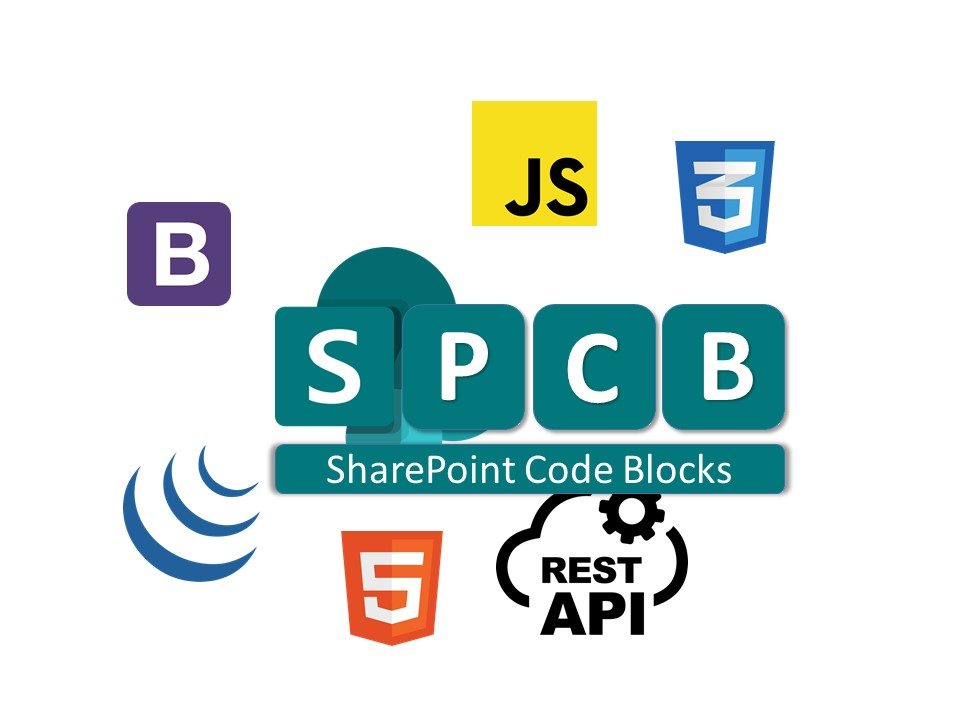

# **Welcome to SharePoint Code Blocks (SPCB)**

# What is SPCB?

#### SharePoint Code Blocks(SPCB) hosts various code blocks a.k.a functions that I have been using over the years which I think can help any SharePoint developer to accomplish most of the common requirements with ease.

# Which SharePoint versions these blocks work on?

#### These blocks are supported in SharePoint 2016 and above environments including SharePoint Online(Classic view only).

# What you can do with SPCB?
- Convert SharePoint forms to Bootstrap forms
- Convert SharePoint date/timestamp to JavaScript format
- Easily get User info like logged in username, email, groups, etc. using SharePoint rest api
- Display SharePoint list data in Datatables and apply styling
- Add a search box with suggestion chips and filter the list

#### I will be posting some of the best practices and beautiful UI components that you can implement for SharePoint at [my blog](http://blog.sheshams.in)
